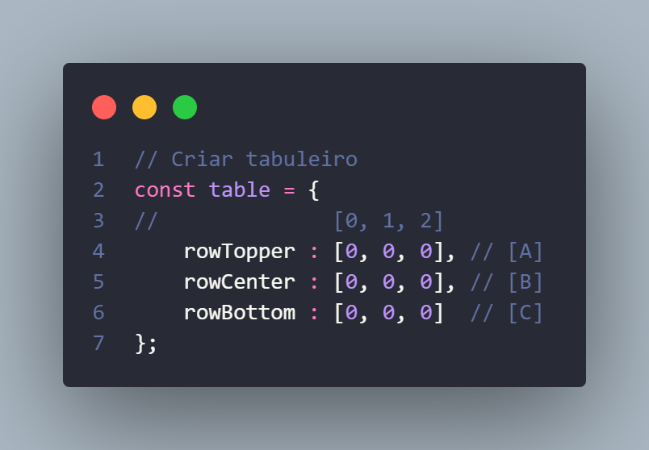
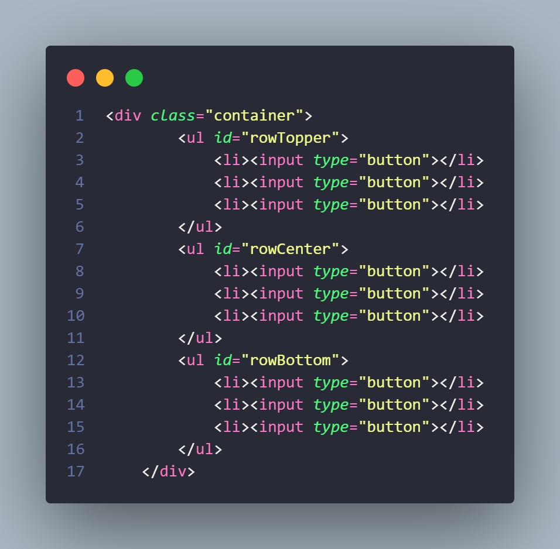
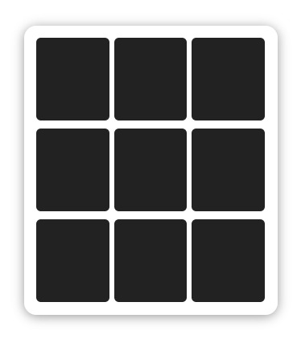
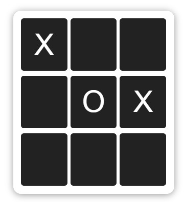
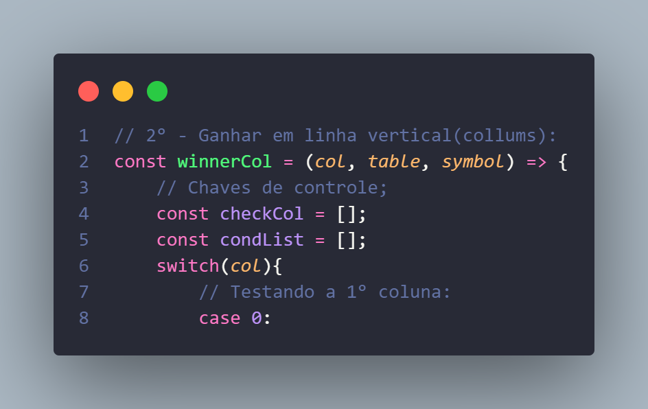
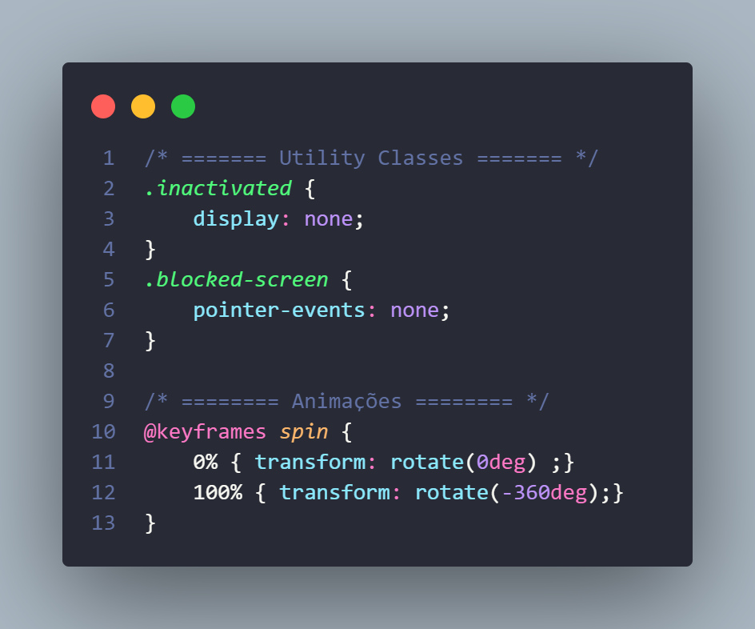

# Jogo da Velha

__Como começou:__  
&nbsp; &nbsp; Chegando final do mês as contas chegam, e não é todas as vezes que conseguimos pagar todas. E dessa vez sobrou pra internet. Em casa e sem poder estudar muito, pensei em fazer um jogo da velha(ou tentar fazer um jogo da velha).

### 3 Dias de projeto.
- *Dia 1:*  
    No primeiro dia fiz o codigo teste do script, trabalhando com o console mesmo. No teste inicial comecei com um **_Objeto_** com três chaves, cada uma com um **_Array_**. Logo vi que iria trabalhar ate o final com aquela variável.

    

     
    Ainda no primeiro dia fiz uma interface visual com HTML e CSS para poder visualizar melhor como tudo estava indo.

    | HTML | Visual |
    | ----- | ----- |
    |  |  |

- *Dia 2:*  
    No segundo dia foi a vez de ligar a interface visual com o script. Trabalhar com DOM ainda é um desafio por não ter prática suficiente. De certo modo foi até mais fácil dessa vez por conta de ter passado um **baita de um sufoco** quando fui fazer um outro projeto meu de Bank(Gastar moedas, comprar, essas coisas, uhuu).

    

- *Dia 3:*  
    Pra mim o dia final é o melhor. É nele que revejo meus comentários, minha estrutaração e minha organização no código. Adiciono talvez comentários adiconais, organizo as classes CSS e revejo meu HTML.

    | CodeComents | CssComents |
    | -------- | -------- |
    |  |  |
### Por fim:
&nbsp; &nbsp; Deixo aqui o link pra você testar e brincar um pouco com esse projeto. Obrigado por ler a documentação! : )